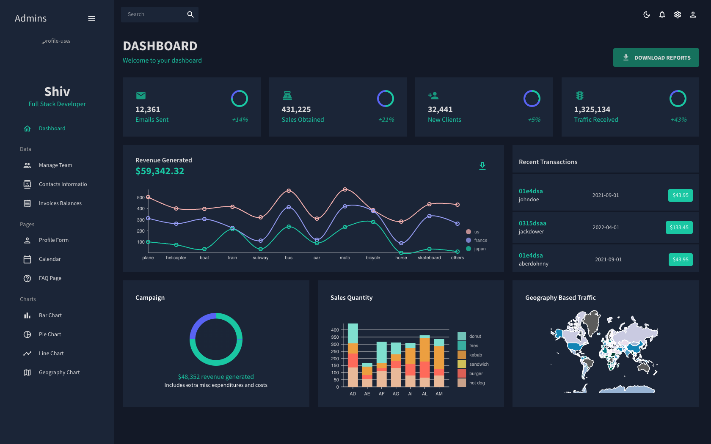

# React Admin Dashboard

## Frontend - ReactJS, MUI
- npm i yup
- npm i formik
- npm i react-router-dom
- npm i @mui/x-data-grid
- npm i react-pro-sidebar
- npm i @fullcalendar/list
- npm i @mui/icons-material
- npm i @fullcalendar/daygrid
- npm i @fullcalendar/timegrid
- npm i @mui/material @emotion/react @emotion/styled

## IDE used

- visual Studio Code

## Nivo Charts

- npm i @nivo/pie
- npm i @nivo/bar
- npm i @nivo/geo
- npm i @nivo/core
- npm i @nivo/line
